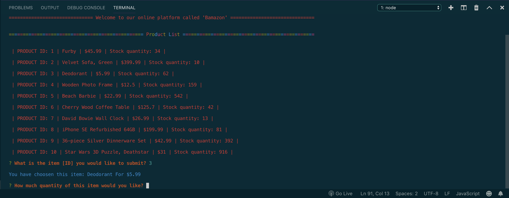
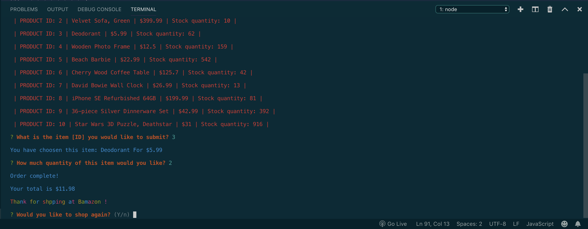
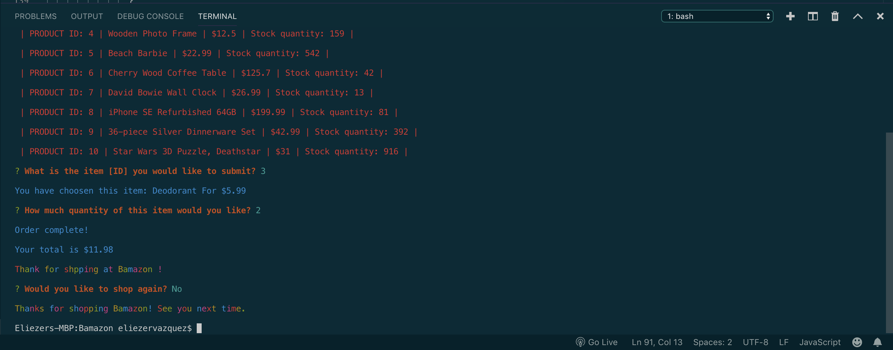

# Bamazon

This is an online shopping-like application that uses a SQL database for inventory management. It has three "views" - one for customers, one for managers, and one for a supervisor.

The app allows customers to purchase items, which are displayed to them with a description and price. When a customer makes a purchase, the database will update the inventory accordingly. If there are not enough units available to satisfy a customers order, they will receive an error message letting them know.

# Demo





## Installing

To run the app locally, you will first need to git clone the repository to your local machine. 

HTTPS:
````
$ git clone https://github.com/Eligv99/bamazon.git
````
SSH:
````
$ git clone git@github.com:Eligv99/bamazon.git
````

Once cloned, cd into the repository and install the necessary dependencies by running:
````
$ npm install
````

You can then run the app in the customer view by running:
````
$ node bamazonCost.js
````

## Built With

* [Node.js](https://nodejs.org/en/) - JavaScript runtime
* [MySQL](https://www.mysql.com/) - Database management
* [npm](https://www.npmjs.com/) - Dependency management


## Authors
See contribution history [here](https://github.com/Eligv99/bamazon/graphs/contributors)
